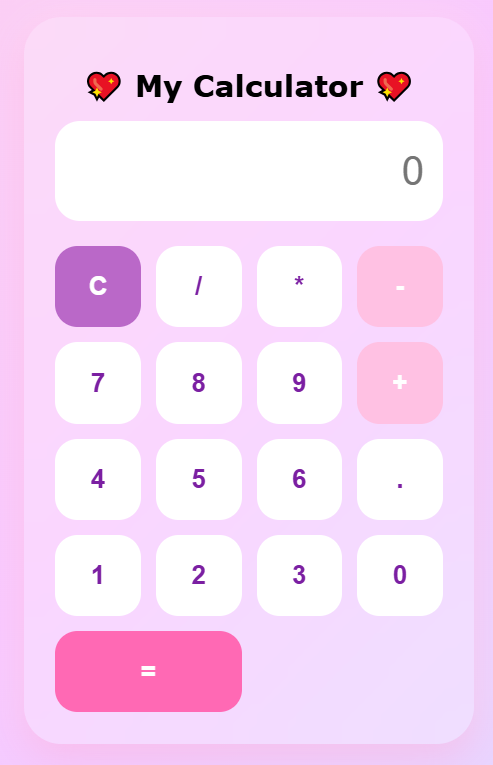

# 💖 My Calculator

A modern and responsive calculator built with **HTML**, **CSS**, and **Vanilla JavaScript**.  
This project features a clean glassmorphism-inspired design and supports basic arithmetic operations.

---

## 🌐 Live Demo

🔗 https://negarlmd.github.io/Calculator/

---

## 📸 Screenshot



> **Note:** Create a folder named `images` and place your screenshot inside it as `screenshot.png`.

---

## ✨ Features

- ➕ Addition
- ➖ Subtraction
- ✖️ Multiplication
- ➗ Division
- 🔢 Decimal numbers
- 🧹 Clear display
- 🟣 Beautiful Glassmorphism UI
- 📱 Responsive design
- ⚠️ Error handling for invalid expressions

---

## 🛠️ Built With

- HTML5
- CSS3
- JavaScript (Vanilla JS)

---

## 📂 Project Structure

```text
Calculator/
│── index.html
│── style.css
│── script.js
│── README.md
│
└── images/
    └── screenshot.png
```

---

## 🚀 Getting Started

1. Clone the repository:

```bash
git clone https://github.com/negarlmd/Calculator.git
```

2. Open the project folder.

3. Open `index.html` in your browser.

---

## 📈 Future Improvements

- ⌫ Backspace button
- % Percentage
- Keyboard support
- Dark / Light mode
- Calculation history
- Scientific calculator functions

---

## 👩‍💻 Author

**Negar Valimohammadi**

- 💻 Computer Programming Graduate
- 🤖 Interested in Artificial Intelligence & Web Development

GitHub:
https://github.com/negarlmd

---

⭐ If you like this project, don't forget to give it a star!
